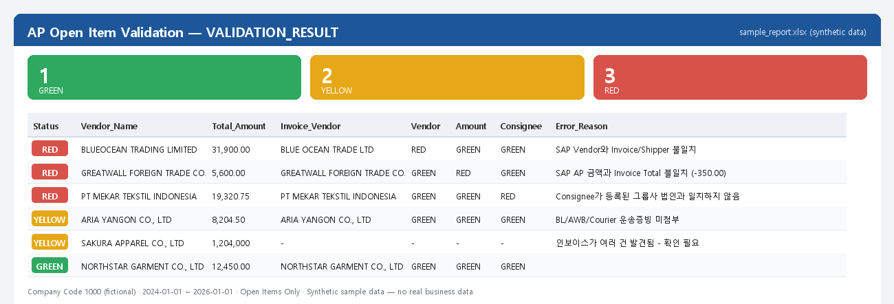

# AP Open Item Validation RPA

A read-only desktop automation that attaches to an already-logged-in SAP GUI
session, pulls every open Accounts Payable item for a company code, cross-checks
each one against its own trade documents (commercial invoice, packing list,
bill of lading / air waybill), and produces a color-coded (GREEN / YELLOW / RED)
Excel audit report — without a human opening a single SAP screen or PDF by hand.

> **Note on this repository:** this is a sanitized version of a real internal
> tool. All company names, vendor names, and system-specific identifiers
> (transaction codes, program names, company codes) have been replaced with
> fictional equivalents. The engineering — the automation logic, the parsing
> heuristics, and the bugs found and fixed along the way — is exactly as it
> ran in production. See [Sanitization](#sanitization) below.



*Rendered from [`docs/sample_report.xlsx`](docs/sample_report.xlsx), generated by
[`docs/generate_sample_report.py`](docs/generate_sample_report.py) — entirely
fictional vendors and amounts, no real business data.*

## The problem

An AP team was manually reconciling every open item in a custom SAP
transaction against scanned invoices and shipping documents scattered across
dozens of email attachments and SAP's own document-attachment system — a
purely clerical, error-prone task with no systematic audit trail. Nobody could
answer "which open items don't actually have supporting documents attached?"
or "which ones have a vendor/amount mismatch?" without manually opening every
single one.

## What it does

```
Phase 0/1  Attach to the logged-in SAP GUI session (never logs in itself,
           never stores credentials) → run the AP Open Item report →
           read the full result grid, preserving SAP's own row order.

Phase 2    Open each item's Commercial Invoice detail screen to pull the
           Incoterm (needed for the FOB posting-date rule).

Phase 3    Open each item's Accounting Document in FB03 and pull real trade
           documents via SAP's standard GOS "Attachment List" — PDF, Excel,
           legacy .xls, RTF, and scanned images/JPEGs, all read directly
           from disk (never trusting the file extension).

Phase 4    Classify each attachment (Invoice / Packing List / B-L / AWB /
           Delivery Receipt / ...) and parse out Vendor, Amount, Currency,
           Consignee, and shipment date — OCR'ing scanned pages where there's
           no real text layer.

Phase 5    Run every validation rule (vendor name match, amount match,
           currency match, consignee is a real group entity, required
           documents are present, FOB posting-date vs. on-board date) and
           combine them into one GREEN / YELLOW / RED verdict per item —
           writing a full Excel report with a SUMMARY, a sortable
           VALIDATION_RESULT sheet, and the raw underlying data for audit.
```

Every step is **read-only**. The tool never logs into SAP itself (it attaches
to a session the user already opened), never stores a password, and never
presses Save / Post / Change / Delete / Release — a guard rail checks the
screen title before every action and refuses to proceed onto anything that
looks like a write screen.

## Why this was hard (and what I learned building it)

The interesting part of this project wasn't the happy path — it was that
almost every early assumption turned out to be wrong once tested against real
data, and the tool had to be redesigned around what was actually true rather
than what seemed reasonable:

- **The grid lies to you.** SAP's ALV grid control only renders rows near the
  current scroll position — reading a row outside that window doesn't error,
  it silently returns an empty string that looks exactly like real blank data.
  A naive full-grid read returned correct data for the first ~60 rows and
  silently blank data for the rest. Fixed by paging through the grid and
  forcing each block to render before reading it.

- **The obvious click API is unreliable.** `GuiCtrlGridView.Click(row, col)`
  silently ignores the row argument in this environment and re-triggers
  whatever row was already selected — a batch run of 127 items returned the
  same vendor's data under 123 different row numbers before this was caught.
  The fix (`SetCurrentCell` + `ClickCurrentCell`) needed a defensive
  cross-check afterward, since this failure mode never raises an exception.

- **The "obvious" attachment mechanism was the wrong one.** The transaction's
  own "Files" popup looked like the natural place to find attachments — until
  testing showed it was almost always empty and crashed the whole SAP session
  on PDF attachments. The real mechanism (discovered by watching how the user
  actually checked attachments) was the standard SAP GOS "Attachment List" via
  FB03 — a completely different, far more reliable code path that had to be
  reverse-engineered live, since its context menu isn't exposed through the
  normal GUI scripting API at all.

- **Real trade documents are genuinely messy.** OCR text from scanned PDFs
  routinely merges two side-by-side table columns onto one physical line (a
  company name run together with a neighboring invoice-number column, or a
  "Shipper" box literally showing the wrong company's own internal
  cross-reference text). Getting from "looks parsed" to "is actually correct"
  took a long iterative loop of finding a real misparsed field, tracing it
  back to the exact source line, and adding a narrow, well-justified rule to
  reject that pattern — never a blanket fuzzy-match that could turn a real
  mismatch into a false GREEN.

- **Floating-point isn't a rounding error, it's a bug.** An Excel formula
  cell that *displays* as `$792.85` can hand Python the raw calculated float
  `792.8499999999849` — comparing that against SAP's clean value failed by
  `1e-11` and flagged a perfectly correct invoice as a mismatch. The fix
  rounds to currency precision (2 decimals) before comparing, which removes
  only the binary floating-point noise — a genuine 1-cent discrepancy still
  correctly fails.

- **Some ambiguity shouldn't be auto-resolved.** A handful of PDFs bundled
  two full "Commercial Invoice" sections in one file — one superseded, one
  current — with no reliable way for the tool to tell which was which. Rather
  than guess, the validation engine flags these explicitly for human review
  instead of silently trusting whichever one it read first.

Every one of the fixes above was verified against a cached snapshot of real
extracted documents and diffed against a known-good baseline before being
trusted, specifically to catch a fix for one case quietly breaking another.

## Design principles

- **Read-only by construction.** No Save / Post / Change / Delete / Release
  action exists anywhere in the codebase, and a screen-title guard blocks
  proceeding onto anything that looks like a write screen.
- **Never guess a SAP GUI Object ID.** Every field/button/grid ID was
  discovered live against the real screen (`tools/discover_sap.py`) — none
  are assumed from documentation or memory.
- **Never silently default to GREEN.** Anything the tool can't confidently
  parse becomes YELLOW ("needs manual review"), never a false pass.
- **Config over hardcoding.** Company code, transaction codes, and the list
  of approved group entities all live in a local, gitignored config file —
  never in source.
- **Decimal, never float, for money.** All amount comparisons use Python's
  `Decimal` type parsed from the original string, not a coerced float.

## Tech stack

Python · `pywin32` (SAP GUI Scripting COM API) · `openpyxl` / `xlrd`
(Excel, both OOXML and legacy BIFF) · `pypdf` + `PyMuPDF` + `pytesseract`
(PDF text extraction with OCR fallback) · `striprtf` (RTF) · `Pillow`

## Repository layout

```
app/          entry point (app/main.py) - orchestrates all phases
sap/          SAP GUI Scripting automation (connection, navigation, the
              AP Open Item transaction, invoice detail, GOS attachments)
documents/    attachment classification + parsing (Excel/PDF/RTF/image,
              OCR, label-proximity field extraction)
validation/   one independent rule module per business rule, combined by
              validation/engine.py into a final GREEN/YELLOW/RED verdict
report/       Excel report generation (SUMMARY, VALIDATION_RESULT sheets)
config/       *.example.json templates - copy to the real filename and
              fill in your own SAP transaction codes / company code /
              approved entity list (the real files are gitignored)
tools/        tools/discover_sap.py - live SAP GUI Object ID discovery,
              used instead of ever guessing an ID
```

## Setup

1. `pip install -r requirements.txt`
2. Copy `config/settings.example.json` → `config/settings.json` and
   `config/eo_entities.example.json` → `config/eo_entities.json`, filling in
   your own company code, transaction codes, and approved group entities.
3. Log into SAP GUI yourself (the tool never logs in on your behalf).
4. `python app/main.py --end-date today --with-validation`

## Sanitization

This is real, working automation, sanitized for public sharing:

- Company/vendor names → fictional (e.g. the real group entities became a
  fictional group, `ARIA CO., LTD.` and its subsidiaries).
- Custom SAP transaction codes / program names → moved out of source into a
  gitignored config file, with fictional defaults in the committed example.
- Real downloaded trade documents, run logs, and validation reports are
  gitignored outright and never committed — see `.gitignore`.

Nothing about the automation's behavior, the bugs found, or the fixes applied
was altered — only the names.
